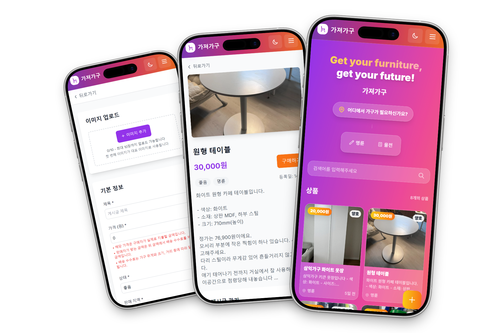
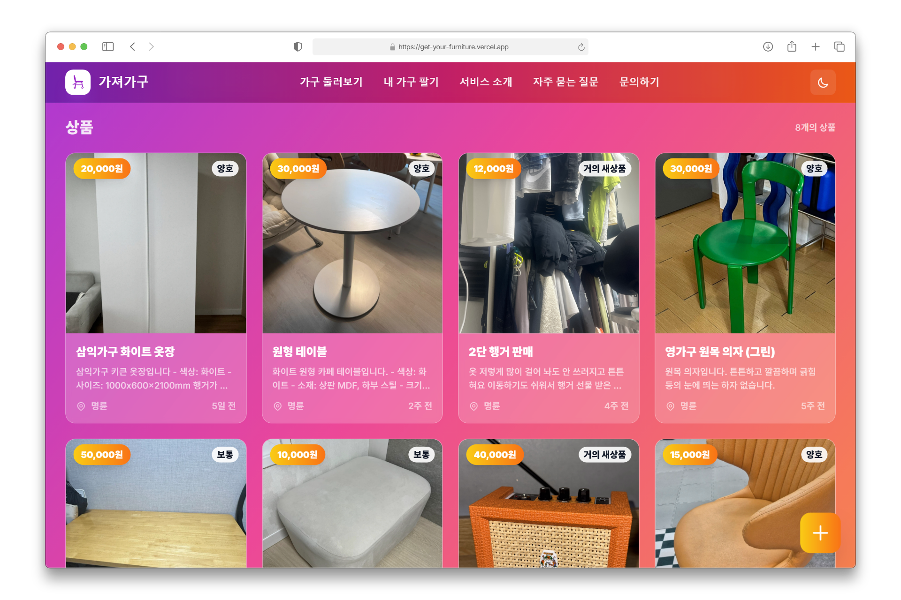
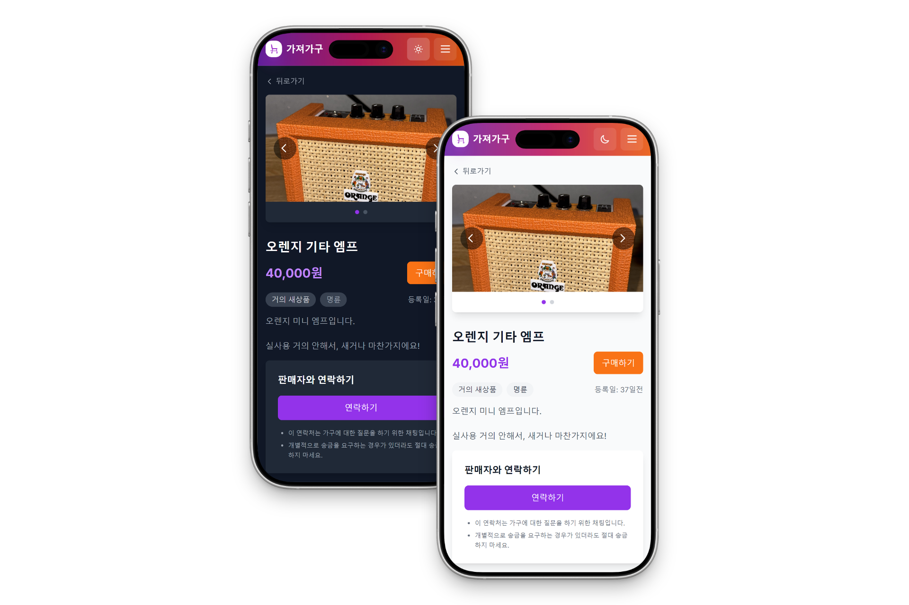
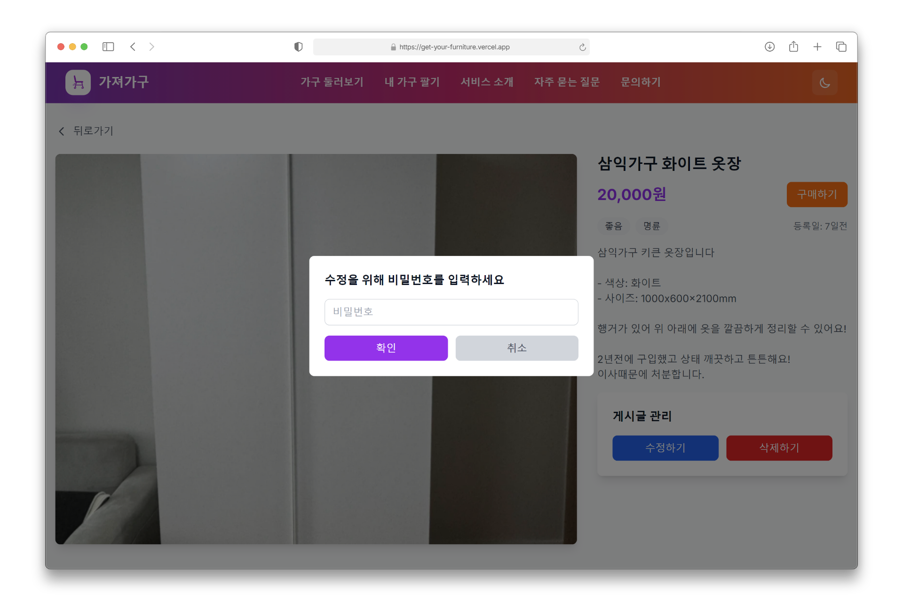

# 🪑 가져가구 (Get Your Furniture) - 중고가구 거래 플랫폼

<p align="center">
  
  
  
  
  
</p>

> **명륜·율전 캠퍼스 인근**에서 학업과 생활을 하는 성균관대학교 학생들을 위한 중고가구 거래 플랫폼입니다.  
> 기숙사 입실·퇴실, 자취방 이사 등으로 필요한 가구를 학생들끼리 안전하고 편리하게 거래할 수 있습니다.

## ✨ 주요 기능

### 📱 모바일 최적화 UI

모바일 환경에 최적화된 인터페이스로 언제 어디서나 가구를 검색하고 등록할 수 있습니다.

<p align="center">  </p>

### 💻 반응형 디자인

다양한 화면 크기에 맞춰 최적화된 레이아웃을 제공합니다.

<p align="center">  </p>

### 🌙 다크모드 지원

사용자 환경에 맞는 라이트/다크 테마를 제공합니다.

<p align="center">  </p>

### 🔐 간편 인증

회원가입 없이 비밀번호만으로 게시글을 등록하고 관리할 수 있습니다.

<p align="center">  </p>

### 📎 추가 기능

- 이미지 업로드 및 최적화
- 파일 첨부 문의 시스템
- 실시간 데이터 업데이트
- 빠른 검색 및 필터링

## 🛠 기술 스택

| 구분 | 역할 | 사용 기술 |
| :--- | :--- | :--- |
| **Frontend** | Framework | `Nuxt.js 4` (Vue.js 3.5) |
| | Language | `TypeScript` |
| | Styling | `Tailwind CSS` |
| | State Management | `Pinia` |
| | UI Components | `Headless UI`, `Heroicons` |
| | Image Optimization | `@nuxt/image` |
| | Utilities | `@vueuse/nuxt` |
| **Backend & DB** | BaaS Platform | `Supabase` |
| | Database | `PostgreSQL (Supabase)` |
| | Authentication | `Supabase Auth` |
| | File Storage | `Supabase Storage` |
| | Real-time | `Supabase Realtime` |
| **Development** | Package Manager | `npm` |
| | Code Quality | `ESLint`, `Prettier` |
| | Theme Management | `@nuxtjs/color-mode` |
| | Node.js | `18+` |

## 🚀 시작하기

### 필수 요구사항
- Node.js 18+ 
- npm 또는 yarn
- Supabase 계정 (데이터베이스 및 스토리지)

### 설치 및 실행

```bash
# 저장소 복제
git clone https://github.com/g-yunjh/get-your-furniture.git
cd get-your-furniture

# 의존성 설치
npm install

# 환경 변수 설정 (.env 파일 생성)
# SUPABASE_URL=your_supabase_project_url
# SUPABASE_ANON_KEY=your_supabase_anon_key

# 개발 서버 실행
npm run dev
# 브라우저에서 http://localhost:3000 접속
```

### 프로덕션 빌드

```bash
# 빌드
npm run build

# 정적 사이트 생성
npm run generate

# 프로덕션 미리보기
npm run preview
```

## 📁 프로젝트 구조

### 페이지 구조
```
/                      # 홈 (제품 목록)
/furniture/create      # 제품 등록
/furniture/[id]        # 제품 상세
/furniture/[id]/edit   # 제품 수정
/contact               # 문의하기
/about                 # 회사 소개
/faq                   # 자주 묻는 질문
```

### 폴더 구조
```
├── app/                 # 앱 설정 및 전역 파일
├── assets/             # CSS, 이미지 등 정적 자산
│   └── css/
├── components/         # Vue 컴포넌트
│   ├── furniture/      # 가구 관련 컴포넌트
│   ├── layout/         # 레이아웃 컴포넌트
│   └── ui/             # UI 컴포넌트
├── composables/        # Vue 컴포저블
├── pages/              # 라우트 페이지
│   └── furniture/      # 가구 관련 페이지
├── public/             # 공개 정적 파일
├── stores/             # Pinia 스토어
├── types/              # TypeScript 타입 정의
├── utils/              # 유틸리티 함수
├── nuxt.config.ts      # Nuxt 설정
└── package.json        # 프로젝트 의존성
```
